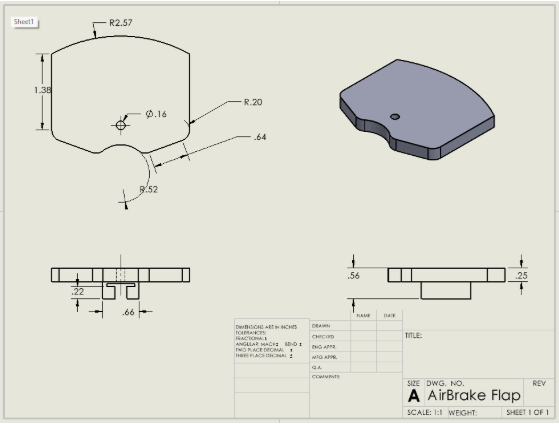
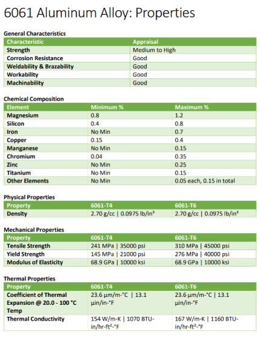
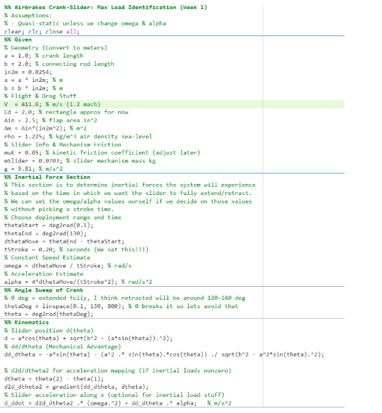
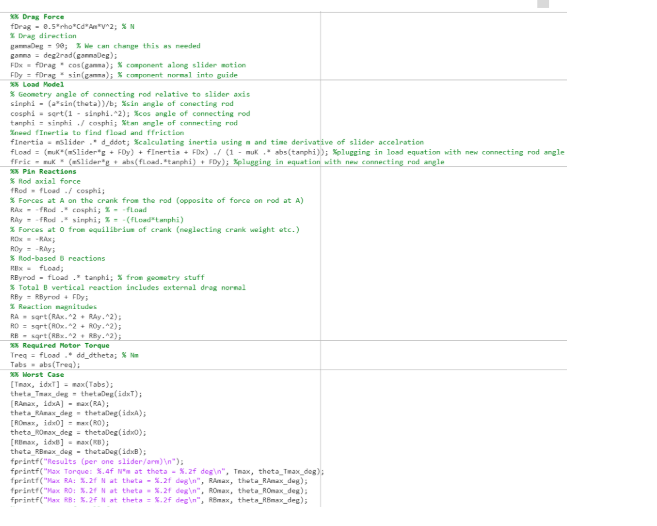
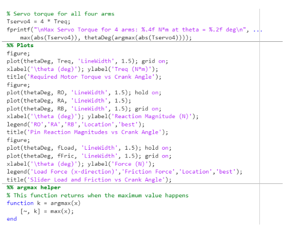

# Phase 2 Report  
Principles of Mechanical Design  

**Team Members:** Benjamin Givens, Isaac Rosas, Alex Wang, Katherine Heaslet, Jamison Cabral, Johnathan Villeneuve  
**Date:** 3/25/26  

---

# 1. Final Design Overview

The mechanical system selected for this project is an aircraft air brake (speed brake) mechanism used in aerospace applications. The primary mechanism of interest is the deployment and retraction of braking flaps, which closely models a modified slider-crank mechanism. The overall function of the air brake system is to provide active control over the altitude of a flight vehicle by varying aerodynamic drag. In this project, the system is modeled for a 6-inch-diameter solid rocket applicable to commercial, defense, or hobbyist use. Traditionally, target altitudes in collegiate rocketry were achieved through passive design methods such as mass adjustment or aerodynamic optimization. More recently, active control systems have been adopted in both industry and academic settings, where onboard computers perform real-time calculations to determine flap deployment based on drag production in order to accurately reach a desired altitude. The mechanism for the airbrake and how it works will be broken down in the next sections.

Air-brake systems are used in a variety of real-world aerospace applications, including aircraft, missiles, and guided flight vehicles. Their primary function is to provide active control over aerodynamic drag and, in some configurations, assist with trajectory or directional control. By deploying external flaps into the airflow, the system increases drag in a controlled manner, allowing the vehicle to regulate velocity and flight behavior during operation.

There are multiple air-brake designs depending on the application, ranging from simple hinged flaps to more complex multi-linkage mechanisms. Despite design variations, all air-brake systems share the common goal of modifying aerodynamic forces through controlled mechanical deployment.

---

## 1.2 Major Components

For our system, we have a total of 8 components. They are the airbrake base, bottom base, air brake flaps, main spindle, fasteners, linkages, guide rails, and electronics.

The bottom base is used to enclose the electronic components of our system. Our electronic components consist of a servo motor, battery, and transmission. Besides only enclosing our electronic components, they will also provide structural support and help align our moving parts.

The airbrake base is what the linkages will connect to. It will have a spindle going through the middle, which will be connected to a servo motor. When the servo motor is actuated, the torque it produces will turn the base, resulting in the deployment of the airbrake flaps.

Airbrake flaps are what will essentially slow down the rocket. When deployed by the spindle, they will increase the aerodynamic drag of the rocket and translate along a guide rail. The guide rail will allow the flaps to translate linearly during deployment and retraction. Additionally, other than allowing the flaps to translate linearly, the guide rails will help ensure no unwanted rotation or misalignment occurs during deployment.

The main spindle is the primary rotary mechanism. It will have a rod going through it which is connected to the servo motor. When the servo motor is activated, the torque it produces will cause the rod to rotate, turning the spindle, and in turn deploying the airbrake flaps.

The fasteners are what will hold all the parts together. For this project, the fasteners that will be used are a clevis pin, a flathead screw, and a dowel pin. The pins and screw are used to fasten the airbrake flaps, secure the guide rail, and connect the linkage to the spindle, respectively.

Linkages will connect the air brake flaps to the spindle. They will allow the airbrake flaps to deploy when the spindle rotates.

The guide rails are what's going to constrain the motion of the air brake flaps and prevent false deployment. As stated earlier, they will constrain the movement of the airbrake flaps to have a linear translation and ensure no unwanted rotation or misalignment occurs during deployment.

The electronics used in this system will be a servo motor and a battery. They both play a key role in deploying the airbake flaps. The servo is what’s going to provide the needed torque, whereas the battery will provide the needed power for the servo motor.

---

### CAD Images:

#### Bottom Base:
  
*Figure: Bottom Base*

#### Airbrake Base:
  
*Figure: Airbrake Base*

#### Airbrake Flap:
  
*Figure: Airbrake Flap*

#### Main Spindle:
  
*Figure: Main Spindle*

#### Guide Rail:
  
*Figure: Guide Rail*

#### Linkage:
  
*Figure: Linkage*

---

## 1.3 Changes from Phase 1

The only change made from phase 1 is the geometry of our parts. The parts that were changed are the airbrake flaps' size, the size of the guide rail, the locations and size of all the holes needed to secure the parts, and the size of the airbrake base. The size of the flaps was changed because they were too small to have any real effect on the speed of the rocket. Because the size of the airbrake flaps was changed, the size of the guide rails had to be changed as well. Changing these two components allowed for an airbrake with an actual effect on the speed of the rocket. Another big change made was the size and location of the holes. This had to be changed because the initial locations decided upon wouldn’t allow for a working assembly. Because the size and locations of the holes changed, the size of the airbrake base also changed. If the airbrake base size were to stay consistent, then there wouldn’t be enough room for the linkages to translate linearly. All of these changes were made as the assembly was put together and are key in allowing for a functional airbrake base.

---

# 2. CAD Model Development

## 2.1 Assembly Model

The CAD assembly consists of 8 parts. They are the airbrake flaps, airbrake base, bottom base, linkage, spindle, guide rail, flathead screw, clevis pin, and dowel pin. They are all connected through the fasteners selected. The clevis pin is used to allow for the linkage to move when the spindle rotates, whereas the dowel pin makes sure no movement occurs while ensuring an accurate alignment. Additionally, besides the functions mentioned, the pins are also there to handle shear stress the system will experience during deployment. The screw is there to help hold everything together that won’t experience much shear stress. Regarding how everything is connected in the assembly, it’s through concentric, coincident, and parallel mates. The concentric mate is to make sure everything is aligned vertically and the coincident mate is used to have the objects lying on the same plane. Parallel mates had to be used because it made sure that two or more objects are linear with each other during deployment (the airbrakes themself and the base).

---

### CAD Images (Undeployed):
  
*Figure: CAD Images (Undeployed)*

### Deployed:
  
*Figure: Deployed*

## 2.2 Exploded View

Explain the exploded view.

  
*Figure: Exploded View*

As seen in the image above, the exploded view, all the parts are connected by pins and screws. The linkage is connected to the flaps by a dowel pin, while the guide rails are connected to the airbrake base with a screw. Connecting the flaps to the linkage with a dowel pin allows us to treat it as a cantilever beam. This makes it easier to conduct FEA on the linkage and perform hand calculations if needed.

The assembly begins with the bottom base, which the airbrake base will slide into. These two components will be held together by screws or pins in the future. On the airbrake base, there will be holes to connect the guide rails onto the base. This will ensure that the guide rails don’t move or cause any unnecessary movements/rotations. On top of the guide rails are the airbrake flaps. The airbrake flaps are connected to the main spindle via linkages, as shown in the image above. They’re connected to each other by the use of pins. This makes it so that the linkages can be treated as cantilever beams while also having high tolerance to shear stress.

---

## 2.3 Motion Study

The motion study was conducted to analyze the kinematic behavior of the air brake system and verify proper actuation of the flaps. The mechanism consists of four air brake flaps mounted symmetrically and connected to a central rotating spindle through a system of linkages.

### Description of Motion

The primary moving components in the system include the central spindle, the connecting linkages, and the four air brake flaps. The spindle rotates about its axis from a torque provided by the servo motor, driving the motion of the attached linkages. These linkages are connected to each flap and guide their movement in and out relative to the vehicle body.

### Motion Transfer Through the Mechanism

Motion is initiated as rotational input at the spindle. This rotational motion is transferred through crank-like linkages that convert the rotation into linear displacement. The mechanism behaves similarly to a crank-slider system, where the rotation of the spindle causes the linkages to extend or retract. As a result, the flaps translate outward (deploy) or inward (retract) in a controlled manner. The linkage geometry ensures synchronized movement of all four flaps.

### Simulation Results

The motion simulation demonstrates smooth and coordinated deployment of the air brake flaps. As the spindle rotates, all four flaps extend outward simultaneously, reaching their maximum deployed position at the designed rotation angle. The simulation confirms that there is no interference between components and that the motion is consistent across all linkages. Additionally, the study verifies that the mechanism achieves the intended range of motion and responds predictably to input rotation.

---

## 2.4 Part Drawings of the Critical Parts

### Linkage Drawing:
  
*Figure: Linkage Drawing*

### Airbrake Flap Drawing:
  
*Figure: Airbrake Flap Drawing*

The drawings made for the assembly are the airbrake flap and the linkage. These are the two critical parts for our assembly and are what we performed FEA on.

---

# 3. Design for 3D Printing and Assembly

## 3.1 Printability

We will be using a Bambu Lab P2S to print our components. This will allow us a 256 x 256 x 256 mm3 volume to print our components in any filament material needed.

Nearly all of our parts have a clean flat surface. This allows us to print without any support and reduces any risk of “spaghetti” during printing. There will be next to 0 overhang on any parts. If there is any overhang, we will use tree supports over grid supports.

We choose tree supports over grid supports as we do not have any critical tall or heavy elements that require a very solid filament-heavy foundation. Tree supports will be more efficient with filament usage, and reduce support contact points on the mechanism. This will reduce surface scarring as well.

---

## 3.2 Minimum Feature Sizes

### Wall Thickness

Thin structural members in the linkage and airbrake housing were designed with minimal wall thickness consistent with standard printing limits. For most load-bearing features, we will use a minimum wall thickness of 1.5 - 2 mm to ensure proper stiffness and prevalent delamination. Thinner cosmetic or non-load-bearing features were kept above 0.8 - 1.2 mm. This corresponds to an extrusion width of the 0.45 mm nozzle.

### Hole Sizes

All pin and fastener holes were oversized just slightly compared to the normal pin diameters to compensate for standard FDM shrinkage.

● 3 mm pin → hole modeled to 3.2 - 3.4 mm  
● ⅛ in pin → hole molded to 0.135 - 0.145 in  

### Clearances of Moving Parts

Clearances between sliding parts were designed with standard FDM tolerances in mind:

● Rotating joins: 0.2 - 0.3 mm radial distance  
● Sliding interfaces: 0.3 - 0.5 mm clearance  
● Linkage-to-housing gaps > 0.5 mm  

These choices allow us to ensure a proper print using a 0.45 mm nozzle and PLA materials. Maintaining minimum wall thickness above two extrusion widths improves the structural strength. Oversizing holes allows for proper pin installation without any need for post-processing. Finally, providing sufficient clearance between moving components ensures that the crank-slider linkage moves smoothly after printing.

---

## 3.3 Assembly Considerations

### How Parts Connect

The airbrake deployment mechanism consists of a crank arm, connecting rod, and sliding airbrake flap. These components are joined using revolute joints at each linkage. This allows for controlled rotational motion while transmitting forces throughout the system. The crank arm is rigidly attached to the motor shaft which allows for rotational input torque to be converted into linear displacement of the airbrake flap.

### How Shafts or Components are Inserted

The crank arm is mounted directly onto the motor output shaft using dowel pins. This ensures reliable torque transmission. Other linkage dowel pins are inserted through aligned holes in the crank arm, connecting rod, and airbrake flap. This allows for assembly without requiring disassembly of any surrounding components.

The sliding track for the air flaps are secured to the frame with stainless steel flat head screws to ensure a smooth surface for minimal surface roughness, rigidity, and structural stability.

  
*Figure: Dowel Pins in Air Flap*

### Accessibility for Fasteners

Fastener locations were selected to remain accessible after installation. The movement of the linkage inside the housing allows for different fasteners to be easily accessed depending on the position of the linkage. There is enough space for any necessary tools to be used within the furthest points inside the housing.

Pin joins are easily removable for maintenance or replacement if wear occurs during testing. This accessibility supports iterative testing and adjustment.

### Modular Design Decisions

The airbrake mechanism was designed as a modular subsystem that can be assembled independently and inserted into the rocket airframe as a single unit. This allows the linkage, motor, and sliding flap components to be tested prior to installation and simplifies replacement if needed.

Separating the actuator module from the rest of the airframe improves serviceability and reduces system complexity during final assembly.

---

# 4. Engineering Analyses

## 4.1 Assumptions and Input Conditions

The loading conditions used in this analysis were obtained from the kinematics team, who performed an inertial analysis of the airbrake system to determine the location and magnitude of maximum loading during operation. Based on their results, the maximum force transmitted through the linkage occurs along the x-direction with a magnitude of 14.51 N.

A key modeling assumption is that all loading in the y-direction is neglected for the linkage arm. This assumption is justified by the system design, in which the drag flap independently carries loads in the y-direction. As a result, the linkage is treated as a two-force member, with forces acting only along its axis.

The material selected for all analyzed components (linkage, pins, and drag flap) is Aluminum 6061, and its mechanical properties are used throughout the analysis.

The applied force originates from the torque transmitted through the central spindle and is distributed through the linkage system.

## 4.2 Static Stress and Factor of Safety

**Component: Linkage Arm**

The linkage arm was selected as a critical component due to its role in transferring load between the actuation system and the drag flap.

The loading condition consists of a uniaxial force of 14.51 N in the x-direction, producing axial stress in the member as well as localized bearing stress at the pin connection.

$$
\sigma = \frac{F}{A}
$$

$$
\sigma = \frac{F}{t d}
$$

Hand calculations were performed to determine both axial and bearing stresses. These results were then compared with ANSYS simulations for validation.

**Axial Stress Results:**  
● Hand Calculation: 0.54467 MPa  
● ANSYS Result: .53999 MPa  

**Bearing Stress Results:**  
● Hand Calculation: 1.702 MPa  
● ANSYS Result: 1.7315 MPa  

$$
n = \frac{S_y}{\sigma}
$$

● Yield Factor of Safety: 129.6 MPa  

The resulting factor of safety is significantly greater than 1, indicating that the linkage will not fail under static loading conditions. The results from ANSYS closely match the hand calculations, validating the analytical approach.

---

### ANSYS Model: Linkage Arm

  
*Figure: Linkage Arm Equivalent Stress*

  
*Figure: Linkage Arm Mid-section Axial Stress*

  
*Figure: Linkage Arm Bearing Stress*

---

## 4.3 Fatigue Assessment

Fatigue analysis was performed on the linkage, and pins (bolts), as both components experience repeated loading during deployment and retraction cycles.

The loading is considered fully reversed (R = -1) because each component transitions between tensile and compressive stresses, passing through zero stress during each cycle.

$$
\sigma_a = \frac{\sigma_{max} - \sigma_{min}}{2}, \quad \sigma_m = \frac{\sigma_{max} + \sigma_{min}}{2}
$$

A stress-life (S-N) approach was used for fatigue analysis. Hand calculations were performed using material fatigue properties for Aluminum 6061, and results were compared with ANSYS fatigue tool predictions.

$$
n = \frac{S_f}{\sigma_a}
$$

**Results:**  
● Linkage Fatigue FOS: 45.3  
● Pin Fatigue FOS: 41.1 ( ANSYS )  

  
*Figure: Linkage Arm Fatigue Life in Cycles*

ANSYS results indicate that all components exhibit infinite fatigue life, which is consistent with the extremely low stress magnitudes observed in both simulation and hand calculations.

This confirms that fatigue failure is not a concern for the system under expected operating conditions.

---

## 4.4 Interface Stress Analysis (Pin Connection)

The pin connection between the linkage and drag flap was analyzed to evaluate shear and bearing stresses.

The pin experiences a shear force equal to the applied linkage load of 14.51 N. The pin has a radius of 0.08 inches, which was used to calculate the cross-sectional area.

$$
\tau = \frac{F}{A}
$$

Shear stress values were computed using both hand calculations and ANSYS:  
● Hand Calculation: 1.3545 MPa  
● ANSYS Result: 1.361 MPa  

Additionally, bearing stress at the pin-hole interface was evaluated as described in Section 4.2.

The calculated stresses are extremely low relative to the material strength of Aluminum 6061, indicating that the pin connection is structurally sound and not at risk of failure.

---

### ANSYS Model: Dowel Pin

  
*Figure: Dowel Pin Shear Stress*

  
*Figure: Dowel Pin Fatigue Life in Cycles*

---

# 5. Global Safety Overview

A summary of all analyzed components and their safety margins is provided below:

Component Failure Mode Factor of Safety  
Linkage Arm Yielding 129.6  
Linkage Arm Fatigue 45.3  
Pin (Bolt) Shear Yield 117.6  
Pin (Bolt) Fatigue 41.1  

Among all components, the linkage arm experiences the highest stress; however, its factor of safety remains extremely high.

Overall, all components demonstrate very large safety margins against both yielding and fatigue failure. The agreement between hand calculations and ANSYS simulations further supports the validity of the analysis.

The system is therefore considered structurally safe and highly over-designed for the given loading conditions, with no expected risk of failure during operation.

---

# 6. Design Risks and Weaknesses

## Wear at Pin Joints

Stress analysis indicates that the linkage and pin connections experience very low stresses relative to the yield strength of aluminum 6061. Repeated deployment cycles may still introduce wear at the revolute pin joints. Over time, this wear could increase clearance in joints and reduce their positional accuracy during deployment. Pin B experiences a large reaction force due to the drag acting on it. This force will not be a risk for joint wear as the structure of the air frame supports the load. Prototype testing will be required to evaluate long-term joint durability.

  
*Figure: Pin Reaction vs Crank Angle Plot*

## Alignment Sensitivity in the Guide Rail System

The airbrake is constrained by guide rails to enforce linear translation during deployment. This improves motion control and prevents rotation but comes with a caveat. The system is very sensitive to any differences in alignment between the guide rails and the linkage geometry. Small misalignment introduced during assembly or printing may increase friction or cause binding issues.

## Structural Assumptions in Linkage Loading

The linkage arm was modeled as a two-force member with loading only in the axial direction. This is based on the assumption that the aerodynamic forces acting in the vertical direction are supported by the drag flap and the guided rail structure. This assumption simplifies the analysis but in the real world, loading conditions may introduce small off-axis forces that were not included in the simulated models.

## Material Limitations from 3D Printed Components

Although all final structural analysis and simulations were performed using Aluminum 6061 components, the prototype will be manufactured using FDM 3D printing materials. These materials have lower strength and reduced fatigue resistance compared to aluminum. As a result, our prototype testing will focus on verifying that our printed linkage components maintain sufficient stiffness and dimensional accuracy when operating.

## Servo Torque

The airbrake deployment mechanism relies on a servo motor to rotate the central spindle and actuate the linkage system. While calculated linkage forces are relatively small, aerodynamic drag forces may increase the required actuator torque beyond predicted values. We modeled the required servo torque in MATLAB and made assumptions for the air density of deployment. Determination of deployment range and usage will further define our expected motor torque requirement.

  
*Figure: Motor Torque vs Crank Angle for 1 Linkage Arm Plot*

## Prototype Testing Stage Requirements

The following aspects of the design should be validated during prototype testing:

● Smooth translation of the airbrake flap along the guide rails  
● Alignment of the linkage pin joints during full deployment motion  
● Verification of required servo torque under simulated drag loading  
● Structural stiffness of printed components under repeated loading cycles  
● Repeatability of deployment and retraction motion  

These tests will confirm whether the assumptions used in any analytical models correctly represent real operating conditions and behavior.

---

# 7. Conclusion

The final design of the airbrake mechanism consists of eight primary components outlined in section 1.2 as the airbrake base, bottom base, airbrake flaps, main spindle, fasteners, linkages, guide rails, and electronics. Together these components form a servo actuated slider-crank system which is capable of deploying and conversely retracting drag flaps to regulate collegiate rocket velocity. The mechanism utilizes a rotational input from a servo motor and converts it into a linear translation of the airbrake flaps, along the nearly frictionless guide rails, providing a controlled aerodynamic braking during flight.

  
*Figure: View of Deployed Airbrake System*

Engineering analyses performed on the critical components; the linkage arm, dowel pins, and drag flaps, consistently demonstrated very high factors of safety under both static and fatigue loading conditions. The linkage arm yielded a static factor of safety of 129.6 for yielding and a 45.3 for fatigue failure. The dowel pin produced a shear yield factor of safety of 117.6 and a fatigue factor of safety of 41.1. Ansys simulations closely match our hand calculations proving our theoretical values, validating the model and confirming the structural integrity of our design. All components were found to exhibit effectively infinite fatigue life under the expected operating conditions, indicating relatively no risk of fatigue related failure during repeated deployment cycles.

  
*Figure: Table of Safety Factors of Components*

Overall, the design is considered highly reliable and structurally sound for its intended applications and cycle of life. The primary risk is identified by joint wear over repeated cycles, guide rail alignment sensitivity, off-axis loading not captured in the two force member assumption, and reduced material properties in FDM printed prototypes. These are all manageable and will be addressed through the prototyping testing and interactive refinement.

With respect to project requirements, the design satisfies all phase 2 deliverables. A full 3D assembly was developed with SolidWorks with appropriate mates and constraints reflecting physical interfaces and motion. Part drawings, an exploded view, and a motion study were produced. All components were designed within the build volume of the Bambu Lab P2S printer, which we have access to, with appropriate wall thickness, hole oversizing, and clearance for FDM manufacturing. Required engineering analyses; static stress, fatigue assessment, interface and pin stresses, and global safety overview. The engineering analyses were completed using both hand calculations and ANSYS simulations, with results summarized and validated throughout. The design therefore meets the objectives within the bounds of the phase 2 requirements and is ready for prototype fabrication and testing.

---

# Demo Video of Assembly

---

# 8. References

Equations:  
Gabrian International. (2026). 6061 Aluminum Alloy property data. MatWeb: Material Property Data. Retrieved March 25, 2026, from https://www.gabrian.com  

Design Guidelines:  
Norton, R. L. (2019). Design of machinery: An introduction to the synthesis and analysis of mechanisms and machines (6th ed.). McGraw-Hill Education.

---

# 9. Appendix

  
*Figure: 6061 Aluminum Alloy Property Table*

  
*Figure: MATLAB Code*

  
*Figure: Slider Load Friction vs Crank Angle MATLAB Plot*

  
*Figure: Extra MATLAB Simulation Data Associated with Torque and Reaction Forces*

  
*Figure: Slider Kinematics and Basic Mechanism Analysis*

  
*Figure: Linkage Pin Reaction Force Calculations and FBD*

  
*Figure: Slider Reaction Force*
